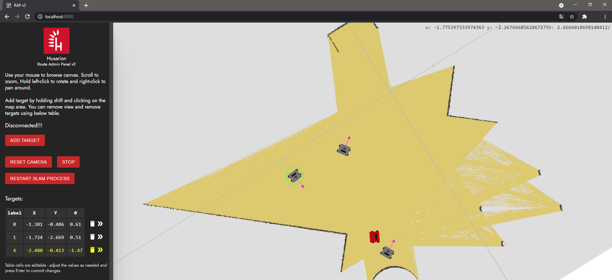

# rap2 - web interface for managing robot movement

RAP2 (Route Admin Panel v2) is single-page web application allowing you to define targets and routes for ROS-based mobile robot.



Modern front-end using React, Three.js bound through react-three-fiber/drei and Webpack 5.0.

## Example: two Docker containers, RAP2 + Gazebo

In below example we set up two containers, one running gazebo simulation and ROS master and the other with RAP2 instance. You will need an X server, Docker and docker-compose installed.

Below commands shall be executed in repository root.

1) enable X server. This will be used by gazebo GUI, not by RAP2. Note: If you're on Windows with WSL2 and Docker Desktop, make sure you have X server for Windows installed and run. VcXsrv is good choice.

```
xhost +local:root
```

2) set up environment variables. You can simply copy example env file from repo, as below. These will be picked up by docker-compose.

```
mv .env.example .env
```

3) build & run:

```
docker-compose up
```

After you're done working with the GUI, it's good idea to disable connections for X server:

```
xhost -local:root
```

## Example: RAP2 on ROSBOT

TODO

## How to build client

Building is straightforward. You will need Node.js.

```
cd client
npm install
npm run build
```

The output will be saved to client/build folder.

Refer to Dockerfile for details on the environment and build process.